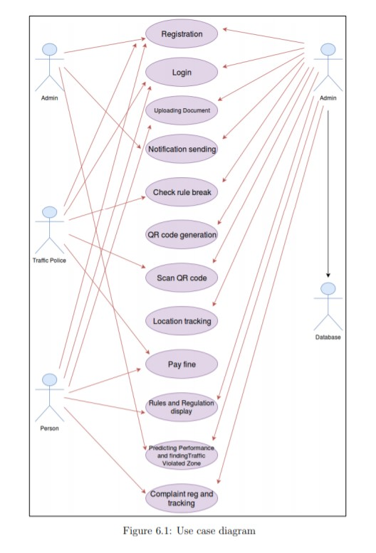
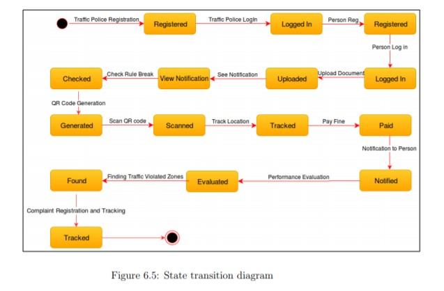
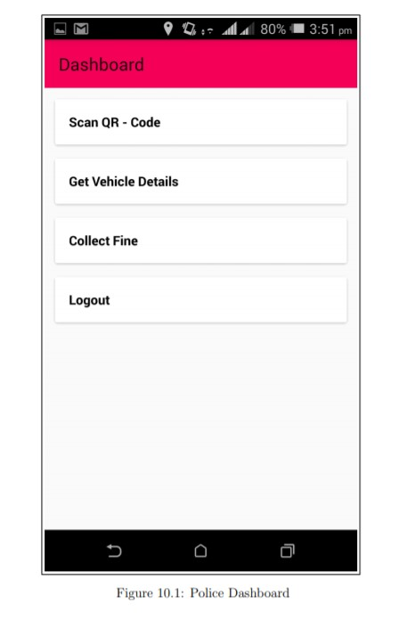
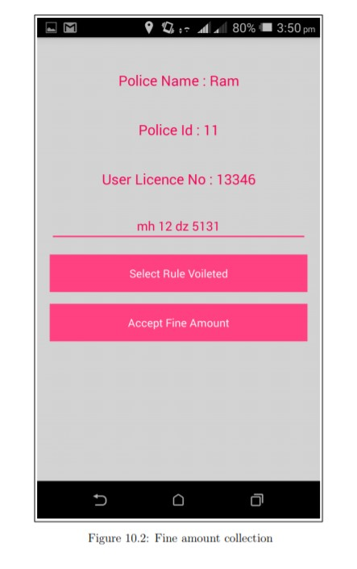
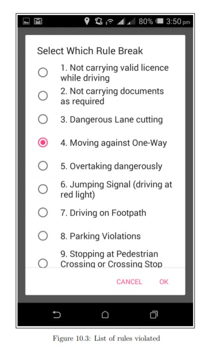
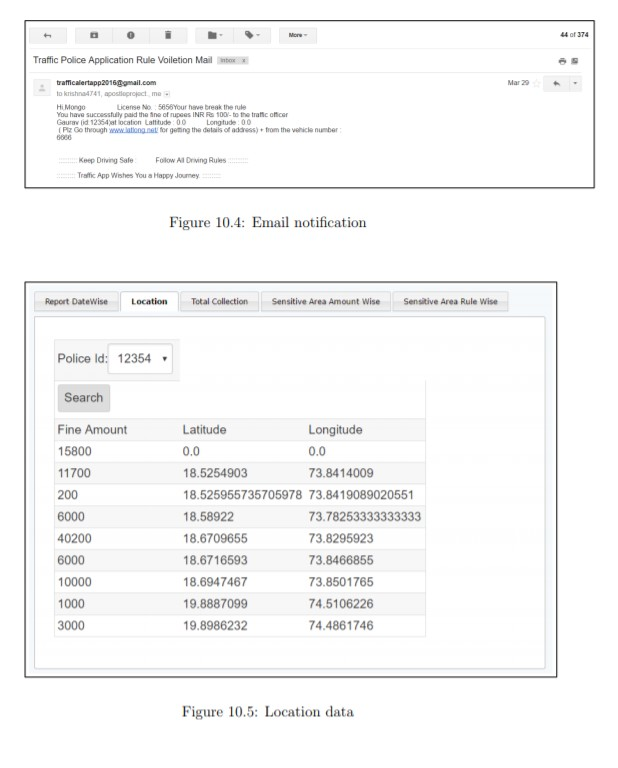
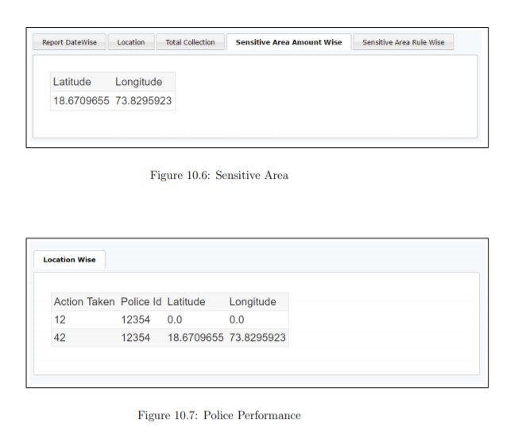
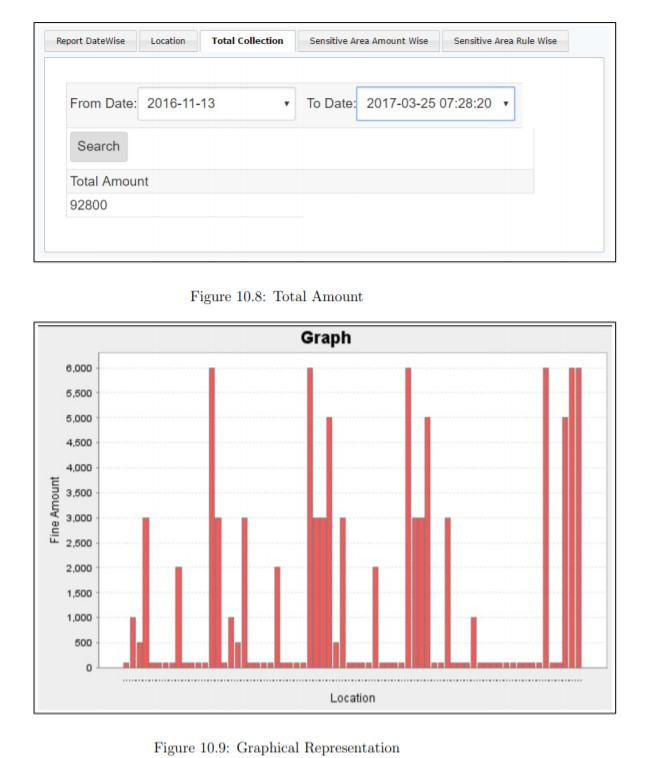

# SmartTrafficPoliceApp

Android app for traffic police containing police and customer login with-
-documents upload-download
-Wallet system
-QR code read and development affecting wallet money

TO DO-
Create database with table names which you can get from PHP files
upload PHP files on web hosting
change Database connection accordingly
and you are good to go !

  

  

  

  

  

